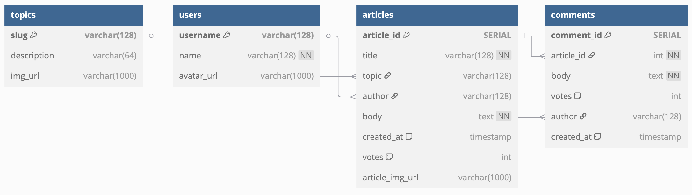

# NC News API

Hosted version: [https://nc-news-3jz4.onrender.com](https://nc-news-3jz4.onrender.com)

GitHub Repo: [https://github.com/bluesky2006/nc-news-be](https://github.com/bluesky2006/nc-news-be)


## Summary

The NC News API is a RESTful backend project built using Node.js, Express, and PostgreSQL. It exposes a variety of endpoints to access and manipulate a Reddit-style news aggregation service. Users can browse articles, vote on them, add comments, and explore topics.

This project was built as part of the Northcoders bootcamp and demonstrates key backend skills including:

- Database schema design and SQL querying
- Express routing and layered MVC architecture
- Comprehensive error handling and data validation
- Integration testing using Jest and Supertest
- Deployment to a live hosting environment (Render)


## Getting Started Locally

These instructions will get the project running on your local machine for development and testing purposes.

### 1. Clone the Repository

```bash
git clone https://github.com/bluesky2006/nc-news-be.git
cd nc-news-be
```

### 2. Install Dependencies

```bash
npm install
```

### 3. Create Environment Configuration

You need two `.env` files in the root of the project to configure the database connections:

#### `.env.development`
```
PGDATABASE=nc_news
```

#### `.env.test`
```
PGDATABASE=nc_news_test
```

> These files tell the app which database to connect to depending on the environment (`development` or `test`).


### 4. Set Up the Local Databases

Make sure PostgreSQL is installed and running on your machine.

Then run:

```bash
npm run setup-dbs
```

This creates the development and test databases using the setup script.


### 5. Seed the Development Database

To populate your local development database with data:

```bash
npm run seed
```


### 6. Start the Server

```bash
npm start
```

By default, the server runs on [http://localhost:9090](http://localhost:9090). You can now make requests to the API using tools like Postman or curl.


### 7. Run the Test Suite

The project includes integration tests written with Jest and Supertest. To run the tests:

```bash
npm test
```

This will run the full test suite against the test database.


## API Documentation

Once running, visit:

```
http://localhost:9090/api
```

You’ll see a JSON object describing all available endpoints, their accepted methods, required parameters, and example responses.


## Requirements

To run this project, you’ll need:

- **Node.js:** v20.11.0 or higher (tested with v23.11.0)
- **PostgreSQL:** v14 or higher

All other dependencies can be installed via `npm install`.


## Contact

Feel free to fork this repo, open issues, or reach out with feedback via GitHub. This project forms part of my portfolio – if you're checking this out from my CV, thanks for stopping by!

## Database diagram



